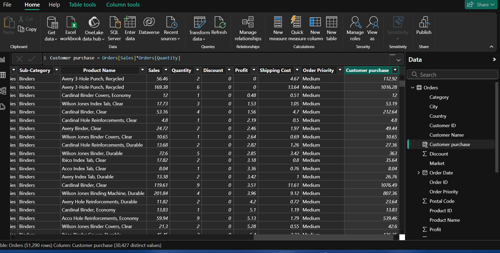
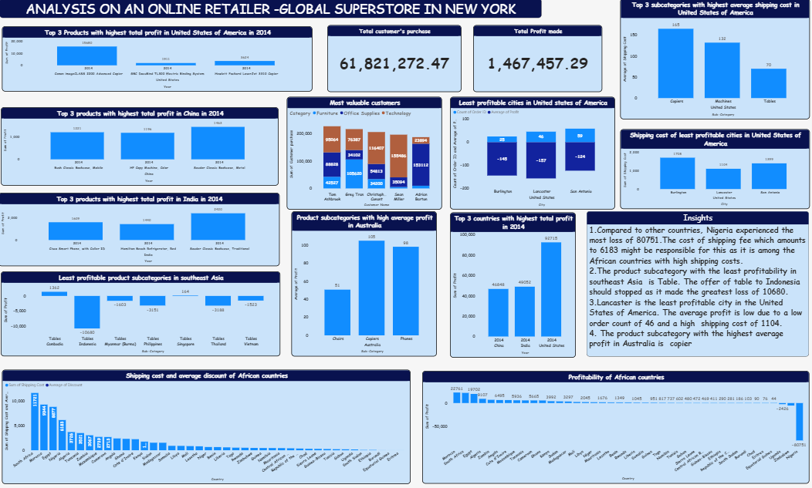

# Analysis on an online retailer- Global Superstore

---
## Introduction
This is a Power BI project on sales analysis of an online retailer store called **Global Superstore** 
The project is aimed to analysis, visualize and derive insights to answer crucial questions that will help in making informed decisions to improve performance and profitability.
This is my capstone project after learning data analytics at **Digitaley drive**

**_Disclaimer_**: _All datasets and reports do not represent any company, institution or country, but just a practice exercise to demonstrate capabilities in data analytics_.

## Problem Statement

1. a) What are the three countries that generated the highest total profit for Global Superstore in 2014?
b) For each of these three countries, find the three products with the highest total profit. Specifically, what are the products' names and the total profit for each product?

2. a) Identify the 3 subcategories with the highest average shipping cost in the United States.
   
3. a) Assess Nigeria's profitability (i.e., total profit) for 2014. How does it compare to other African countries?
b) What factors might be responsible for Nigeria's poor performance? You might want to investigate shipping costs and the average discount as potential root causes.

4. a) Identify the product subcategory that is the least profitable in Southeast Asia.
Note: For this question, assume that Southeast Asia comprises Cambodia, Indonesia, Malaysia, Myanmar Burma), the Philippines, Singapore, Thailand, and Vietnam.
b) Is there a specific country in Southeast Asia where Global Superstore should stop offering the subcategory identified in 4a?

5. a) Which city is the least profitable (in terms of average profit) in the United States? For this analysis, discard the cities with less than 10 Orders. 
b) Why is this city's average profit so low?

6. a) Which product subcategory has the highest average profit in Australia?
   
7. a)Who are the most valuable customers and what do they purchase?

## Data sourcing
The link to dataset was in the project capstone pdf, downloaded data as excel file then imported to Power BI for analysis.

## Data transformation
Data cleaning and transformation was carried out with power query. The columns were thoroughly checked out to ensure they were valid and devoid of empty cells and errors. 
I sorted profit column in ascending order.
I added a new column and name “customer purchase”. I multiplied sales by quantity (sales*quantity) to get the purchase of each customer.

---

## Data modelling
There was no modelling.

## Analysis and visualisation

These are insights:
1. The three countries that generated the highest total profit for Global Superstore in 2014 are United States of America, India and china.
   
2. Compared to other countries, Nigeria experienced the most loss of 80751.The cost of shipping fee which amounts to 6183 might be responsible for this as it is among the African countries with high shipping costs.
 
3. The product subcategory with the least profitability in southeast Asia  is Table. The offer of table to Indonesia should stopped as it made the greatest loss of 10680.
    
4. Lancaster is the least profitable city in the United States of America. The average profit is low due to a low order count of 46 and a high  shipping cost of 1104.
 
5. The product subcategory with the highest average profit in Australia is copier.
   
6. The most valuable customer are the customers with most amount of purchase and the top 5 are; Tom Ashbrook,Greg Tran,Christopher Conant,Sean Miller and Adrian barton.

## Conclusion
1.Nigeria made losses of 80751 in African.

2.Indonesia incurred losses of 10680 in Southeast Asia.

3. United Stated of America incurred the most profit of 92751 in 2014.

   

